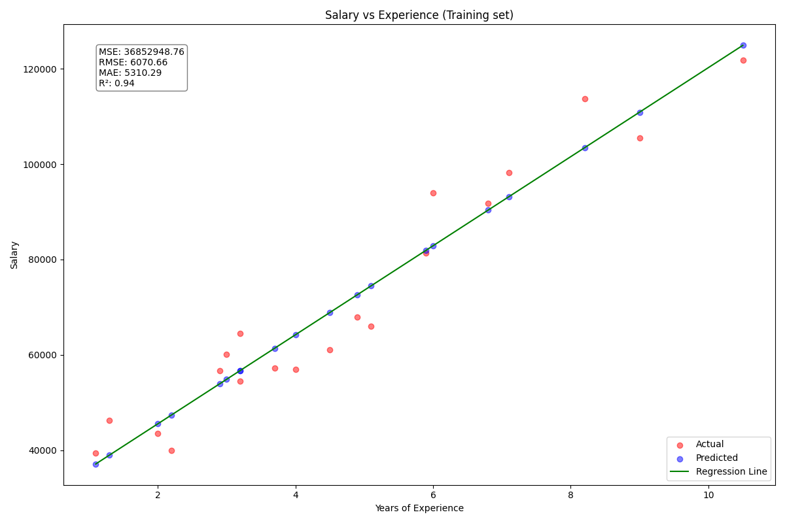
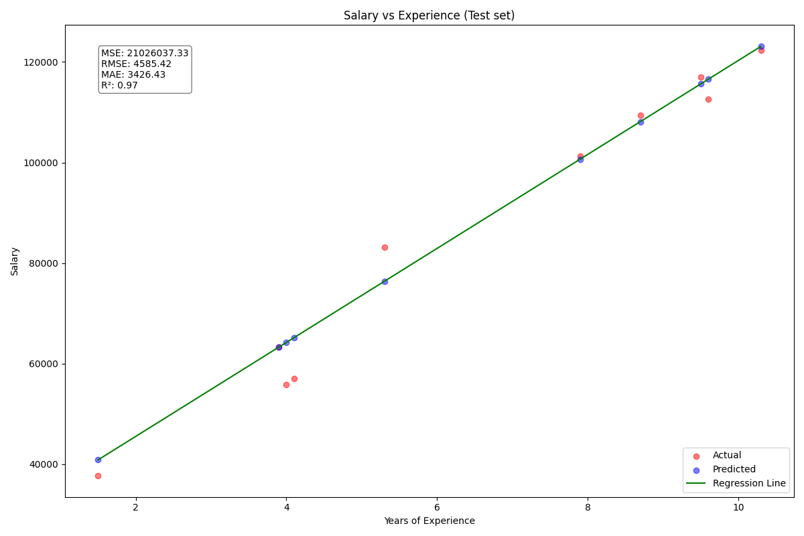
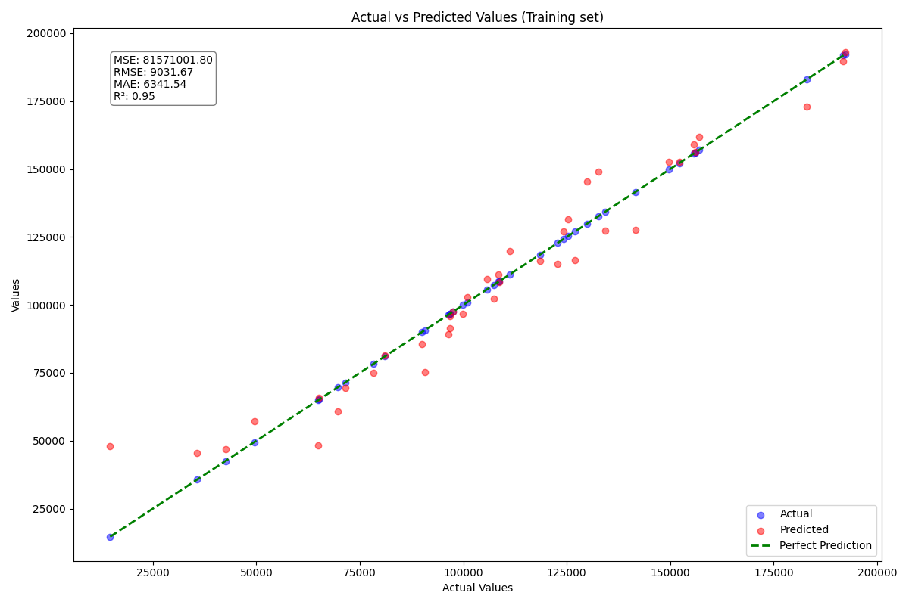
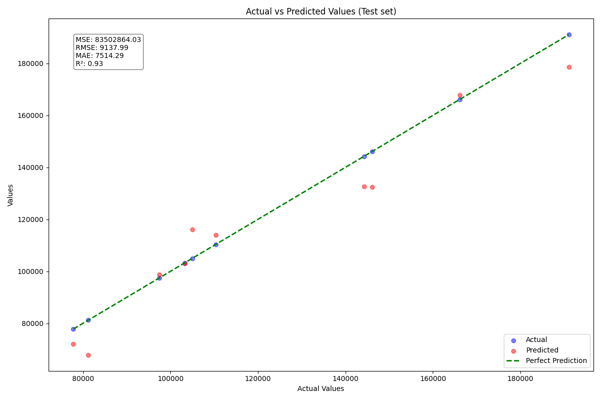
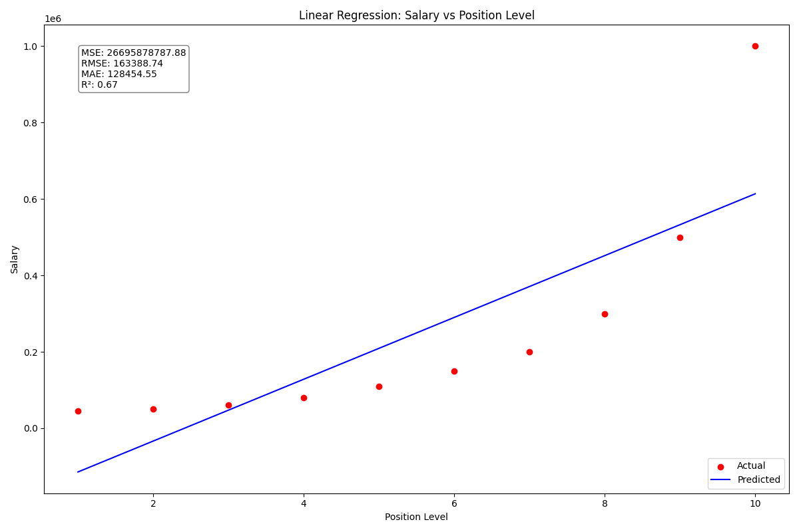
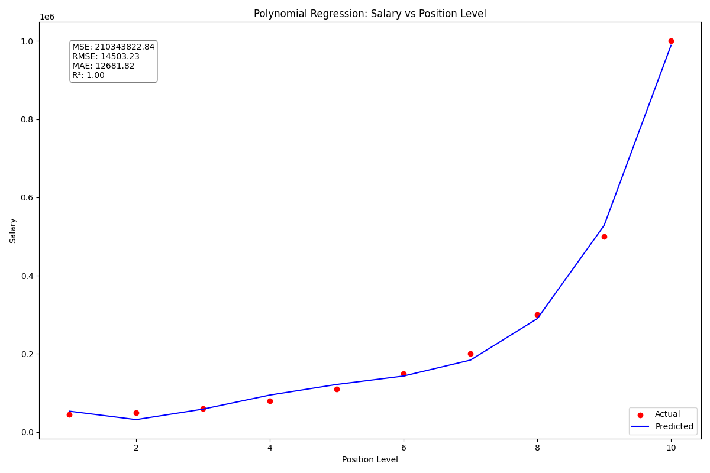
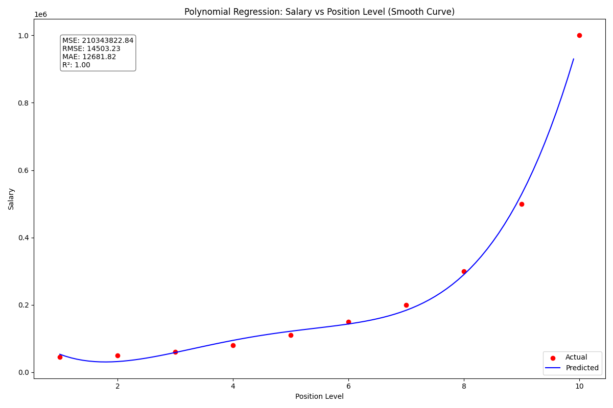
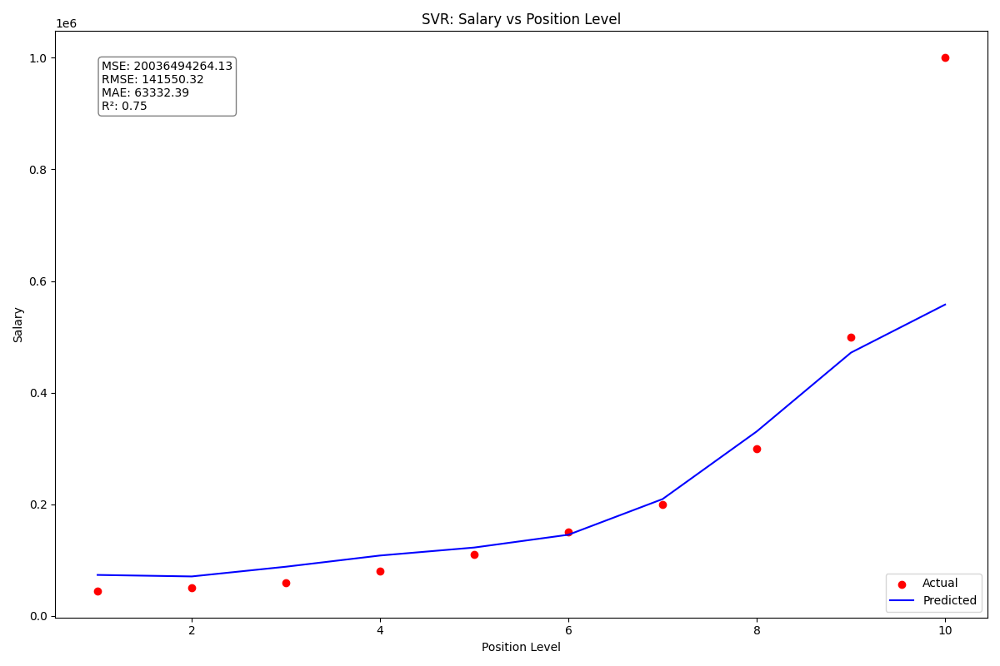
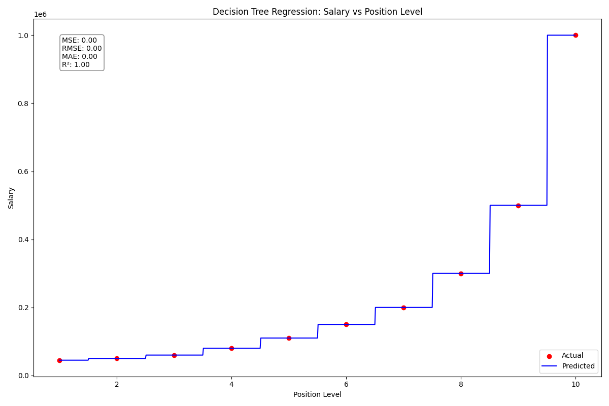
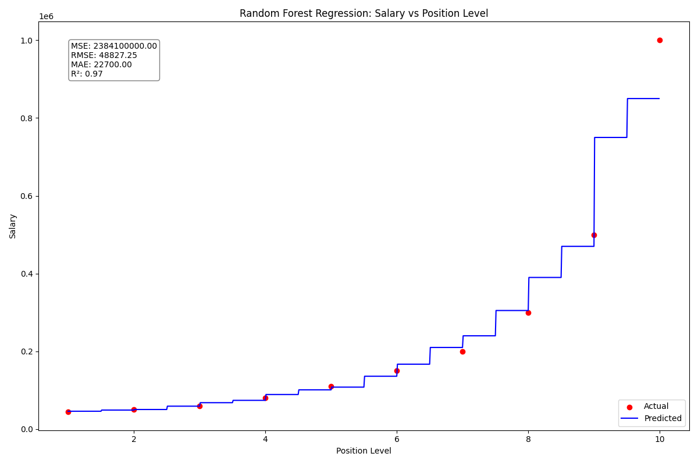

# Regression Analysis: Salary Prediction and Company Profit Forecasting

## Index
1. [Introduction](#introduction)
2. [Understanding Regression Metrics](#understanding-regression-metrics)
3. [Simple Linear Regression: Candidate Salary Prediction](#simple-linear-regression-candidate-salary-prediction)
4. [Multiple Linear Regression: Company Profit Prediction](#multiple-linear-regression-company-profit-prediction)
5. [Polynomial Regression: Accurate Salary Prediction for Experienced Candidates](#polynomial-regression-accurate-salary-prediction-for-experienced-candidates)
6. [Support Vector Regression (SVR): Non-Linear Salary Prediction](#support-vector-regression-svr-non-linear-salary-prediction)
7. [Decision Tree Regression: Non-Linear Salary Prediction](#decision-tree-regression-non-linear-salary-prediction)
8. [Random Forest Regression: Ensemble Approach to Salary Prediction](#random-forest-regression-ensemble-approach-to-salary-prediction)
9. [Conclusion](#conclusion)

## Introduction

This project explores three types of regression analyses: Simple Linear Regression, Multiple Linear Regression, and Polynomial Regression. Each type is applied to a different real-world scenario to demonstrate its capabilities and limitations. Very small datasets were used because the goal is just to test the methods and tools and not to actually solve a large problem.

## Understanding Regression Metrics

Before diving into the specific regression analyses, it's important to understand the metrics used to evaluate the performance of these models. These metrics help us assess how well our models are performing and guide us in selecting the most appropriate model for a given problem.

1. **Mean Squared Error (MSE)**:
   $MSE = \frac{1}{n} \sum_{i=1}^n (y_i - \hat{y}_i)^2$
   
   MSE measures the average squared difference between the predicted values and the actual values. It gives us an idea of how far off our predictions are on average, but it's sensitive to outliers and the scale of the data.

2. **Root Mean Squared Error (RMSE)**:
   $RMSE = \sqrt{\frac{1}{n} \sum_{i=1}^n (y_i - \hat{y}_i)^2}$
   
   RMSE is the square root of MSE. It's in the same units as the target variable, making it easier to interpret. Like MSE, it's also sensitive to outliers.

3. **Mean Absolute Error (MAE)**:
   $MAE = \frac{1}{n} \sum_{i=1}^n |y_i - \hat{y}_i|$
   
   MAE measures the average absolute difference between predicted and actual values. It's less sensitive to outliers compared to MSE and RMSE, and it's also in the same units as the target variable.

4. **R-squared (R²)**:
   $R^2 = 1 - \frac{\sum_{i=1}^n (y_i - \hat{y}_i)^2}{\sum_{i=1}^n (y_i - \bar{y})^2}$
   
   R² represents the proportion of variance in the dependent variable that's predictable from the independent variable(s). It ranges from 0 to 1, where 1 indicates perfect prediction and 0 indicates that the model is just predicting the mean of the target variable.

Where $y_i$ are the actual values, $\hat{y}_i$ are the predicted values, and $\bar{y}$ is the mean of the actual values.

In general:
- Lower values of MSE, RMSE, and MAE indicate better model performance.
- Higher values of R² (closer to 1) indicate better model performance.

However, it's important to note that these metrics should be considered together, and in the context of the specific problem. For instance, a high R² doesn't necessarily mean a good model if the RMSE is unacceptably large for your specific use case.

Now, let's explore each regression type and see how these metrics help us evaluate their performance.

## Simple Linear Regression: Candidate Salary Prediction

### Problem Statement
This is a dataset of job candidates with their years of experience and corresponding salaries. The goal is to build a model that can predict the salary of new candidates based on their years of experience. This model could be used to categorize candidates in terms of salary for a job application process.

### Dataset
The dataset (`Salary_Data.csv`) contains two columns:
- Years of Experience
- Salary

### Approach
A Simple Linear Regression was used to model the relationship between years of experience and salary. The model was trained on a portion of the dataset and tested on the remaining data to evaluate its performance.

### Formula
The simple linear regression model can be expressed as:

$Y = \beta_0 + \beta_1X + \epsilon$

Where:
- $Y$ is the dependent variable (Salary)
- $X$ is the independent variable (Years of Experience)
- $\beta_0$ is the y-intercept (base salary)
- $\beta_1$ is the slope (salary increase per year of experience)
- $\epsilon$ is the error term

### Results

The model shows a strong linear relationship between years of experience and salary. The results are as follows:

- Training Set:
  - Mean Squared Error: 36,852,948.76
  - Root Mean Squared Error: 6,070.66
  - Mean Absolute Error: 5,310.29
  - R-squared Score: 0.94

- Test Set:
  - Mean Squared Error: 21,026,037.33
  - Root Mean Squared Error: 4,585.42
  - Mean Absolute Error: 3,426.43
  - R-squared Score: 0.97

- Model Coefficient (Slope): 9,345.94
- Model Intercept: 26,816.19

The model equation based on the results is:

$Salary = 26,816.19 + 9,345.94 \times YearsOfExperience$

The high R-squared values (0.94 for training and 0.97 for test) indicate that the model explains a large portion of the variance in salary based on years of experience. The model performs slightly better on the test set, which suggests good generalization. The slope indicates that, on average, salary increases by about $9,346 for each year of experience. This model can be used to quickly categorize job applicants based on their expected salary range, given their years of experience.

## Multiple Linear Regression: Company Profit Prediction

### Problem Statement
This dataset contains information from 50 startups, including their R&D spend, administration costs, marketing spend, and location (state). The goal is to build a model that can predict a company's profit based on these features. This model could be used to predict the profits of companies in the test set.

### Dataset
The dataset (`50_Startups.csv`) contains the following columns:
- R&D Spend
- Administration
- Marketing Spend
- State
- Profit

### Approach
Multiple Linear Regression was used to model the relationship between the various features and the company's profit. Categorical variables (State) were encoded using One-Hot Encoding.

### Formula
The multiple linear regression model can be expressed as:

$Y = \beta_0 + \beta_1X_1 + \beta_2X_2 + \beta_3X_3 + ... + \beta_nX_n + \epsilon$

Where:
- $Y$ is the dependent variable (Profit)
- $X_1, X_2, X_3, ..., X_n$ are the independent variables (R&D Spend, Administration, Marketing Spend, State)
- $\beta_0$ is the y-intercept
- $\beta_1, \beta_2, \beta_3, ..., \beta_n$ are the coefficients for each independent variable
- $\epsilon$ is the error term

### Results

The results of the Multiple Linear Regression model are:

- Training Set:
  - Mean Squared Error: 81,571,001.80
  - Root Mean Squared Error: 9,031.67
  - Mean Absolute Error: 6,341.54
  - R-squared Score: 0.95

- Test Set:
  - Mean Squared Error: 83,502,864.03
  - Root Mean Squared Error: 9,137.99
  - Mean Absolute Error: 7,514.29
  - R-squared Score: 0.93

The model's performance is strong, with high R-squared values for both the training (0.95) and test (0.93) sets. This indicates that the model explains a large portion of the variance in company profits based on the input features. The similar performance on both sets suggests good generalization. This model can be used to forecast the potential profits of new companies or to identify which factors most significantly impact a company's profitability.

## Polynomial Regression: Accurate Salary Prediction for Experienced Candidates

### Problem Statement
In this case, the objective was to predict the salary for a candidate who has been a Regional Manager for an extended period (2 years) when they apply to a new company. This position corresponds to a level of 6.5 in the dataset. In this section, Linear and Polynomial Regression are compared to showcase how using the correct model can be essential, as applying a linear model like in the first approach would lead to a very inflated salary.

### Dataset
The dataset (`Position_Salaries.csv`) contains:
- Position Level
- Salary

### Approach
Both Linear Regression and Polynomial Regression were applied to model the relationship between position level and salary. The polynomial features were created using scikit-learn's PolynomialFeatures, but the specific degree was not explicitly stated in the provided code.

### Formula
The polynomial regression model of degree n can be expressed as:

$Y = \beta_0 + \beta_1X + \beta_2X^2 + \beta_3X^3 + ... + \beta_nX^n + \epsilon$

Where:
- $Y$ is the dependent variable (Salary)
- $X$ is the independent variable (Position Level)
- $\beta_0, \beta_1, \beta_2, ..., \beta_n$ are the coefficients
- $\epsilon$ is the error term

For comparison, the linear regression model is:

$Y = \beta_0 + \beta_1X + \epsilon$

### Results

The results for both Linear and Polynomial Regression models are:

Linear Regression:
- Mean Squared Error: 26,695,878,787.88
- Root Mean Squared Error: 163,388.74
- Mean Absolute Error: 128,454.55
- R-squared Score: 0.67

Polynomial Regression:
- Mean Squared Error: 210,343,822.84
- Root Mean Squared Error: 14,503.23
- Mean Absolute Error: 12,681.82
- R-squared Score: 1.00

Predictions for position level 6.5:
- Linear Regression: $330,378.79
- Polynomial Regression: $158,862.45

The Linear Regression model fails to capture the non-linear relationship between position level and salary, resulting in a poor prediction for the Regional Manager position (level 6.5). This is evident from its lower R-squared score (0.67) and significantly higher error metrics. 

The Polynomial Regression model, however, provides a much more accurate prediction by capturing the non-linear nature of the data. Its perfect R-squared score (1.00) and lower error metrics indicate a much better fit to the data. The prediction for the Regional Manager position is also more reasonable and aligned with the observed trend in the data.

It's worth noting that while the polynomial model achieves a perfect R-squared score, this could potentially indicate overfitting, especially with a small dataset. In practice, it's important to validate the model's performance on unseen data to ensure its generalizability.

## Support Vector Regression (SVR): Non-Linear Salary Prediction

### Problem Statement
This analysis uses the same dataset and problem as the Polynomial Regression section: predicting the salary for a candidate who has been a Regional Manager for an extended period (2 years) when they apply to a new company. This position corresponds to a level of 6.5 in the dataset. SVR is used as an alternative approach to capture the non-linear relationship between position level and salary.

### Dataset
The dataset (`Position_Salaries.csv`) contains:
- Position Level
- Salary

### Approach
Support Vector Regression (SVR) with a Radial Basis Function (RBF) kernel was applied to model the non-linear relationship between position level and salary. The data was scaled using StandardScaler to ensure optimal performance of the SVR algorithm.

### Formula
SVR works by finding a hyperplane that best fits the data in a higher-dimensional space. The RBF kernel function is defined as:

$K(x, x') = exp(-\gamma ||x - x'||^2)$

Where:
- $x$ and $x'$ are two samples
- $\gamma$ is a parameter that sets the "spread" of the kernel

The objective function that SVR minimizes is:

$\frac{1}{2}||w||^2 + C\sum_{i=1}^n (\xi_i + \xi_i^*)$

Subject to:
$y_i - (w \cdot \phi(x_i) + b) \leq \epsilon + \xi_i$
$(w \cdot \phi(x_i) + b) - y_i \leq \epsilon + \xi_i^*$
$\xi_i, \xi_i^* \geq 0$

Where:
- $w$ is the normal vector to the hyperplane
- $C$ is the regularization parameter
- $\xi_i$ and $\xi_i^*$ are slack variables
- $\epsilon$ is the margin of tolerance
- $\phi(x_i)$ is the kernel function applied to the input

### Results

The results of the SVR model are saved in the [svr_results.txt](outputs/svr_results.txt) file. Here's a summary:

- Mean Squared Error: 20,036,494,264.13
- Root Mean Squared Error: 141,550.32
- Mean Absolute Error: 63,332.39
- R-squared Score: 0.75

Prediction for position level 6.5: 170,370.02

The SVR model captures the non-linear relationship between position level and salary, as evidenced by the R-squared score of 0.75. This indicates that the model explains 75% of the variance in the salary data. The Mean Absolute Error of 63,332.39 suggests that, on average, the model's predictions deviate by about $63,332 from the actual salaries.

Compared to the Linear Regression model (R-squared: 0.67), the SVR model performs better in capturing the non-linear relationship. However, its performance is not as strong as the Polynomial Regression model (R-squared: 1.00), which might suggest that the Polynomial Regression is better suited for this particular dataset.

The prediction for position level 6.5 (170,370.02) falls between the predictions of the Linear Regression and Polynomial Regression models. This prediction seems more reasonable than the Linear Regression model's prediction, as it takes into account the non-linear nature of the data.

## Decision Tree Regression: Non-Linear Salary Prediction

### Problem Statement
This analysis uses the same dataset and problem as the Polynomial Regression and SVR sections: predicting the salary for a candidate who has been a Regional Manager for an extended period (2 years) when they apply to a new company. This position corresponds to a level of 6.5 in the dataset.

### Dataset
The dataset (`Position_Salaries.csv`) contains:
- Position Level
- Salary

### Approach
Decision Tree Regression was applied to model the relationship between position level and salary. This non-parametric method can capture non-linear relationships without assuming a specific form of the relationship.

### Results

The results of the Decision Tree Regression model are saved in the [decision_tree_results.txt](outputs/decision_tree_results.txt) file. Here's a summary:

- Mean Squared Error: 0.00
- Root Mean Squared Error: 0.00
- Mean Absolute Error: 0.00
- R-squared Score: 1.00

Prediction for position level 6.5: 150,000.00

The Decision Tree Regression model shows perfect fit to the training data, with an R-squared score of 1.00 and zero error metrics. This is a clear case of overfitting. The model has essentially memorized the training data, creating a separate leaf for each data point. While this results in perfect performance on the training set, it's unlikely to generalize well to new, unseen data.

Overfitting in this Decision Tree model occurred due to several factors:

1. Small dataset: With only 10 data points, the model has very limited examples to learn from, making it easy to create a perfect fit by memorizing the data.

2. Lack of pruning or regularization: No maximum depth or minimum samples per leaf were specified, allowing the tree to grow until it perfectly fits each data point.

3. Complex patterns: The salary progression with position level may have complex patterns that the decision tree can capture by creating many splits, leading to overfitting.

While the prediction for position level 6.5 (150,000.00) seems reasonable compared to other models, it's important to note that this prediction is based on an overfit model and may not be reliable for real-world application.

## Random Forest Regression: Ensemble Approach to Salary Prediction

### Problem Statement
This analysis uses the same dataset and problem as the previous regression methods.

### Dataset
The dataset (`Position_Salaries.csv`) remains the same.

### Approach
Random Forest Regression, an ensemble method that combines multiple decision trees, was applied to model the relationship between position level and salary.

### Results

The results of the Random Forest Regression model are saved in the [random_forest_results.txt](outputs/random_forest_results.txt) file. Here's a summary:

- Mean Squared Error: 2,384,100,000.00
- Root Mean Squared Error: 48,827.25
- Mean Absolute Error: 22,700.00
- R-squared Score: 0.97

Prediction for position level 6.5: 167,000.00

The Random Forest Regression model shows a high R-squared score of 0.97, indicating that it explains a large proportion of the variance in the data. While this suggests good performance, it's important to interpret these results cautiously given the small dataset size.

## Conclusion

This project demonstrates the importance of choosing the right regression technique for different scenarios:

1. Simple Linear Regression works well for straightforward relationships like experience vs. salary in entry to mid-level positions.
2. Multiple Linear Regression can handle more complex scenarios with multiple predictors, as demonstrated in the startup profit prediction.
3. Polynomial Regression can capture non-linear relationships, providing more accurate predictions in cases where Linear Regression fails. In our salary prediction case, it showed a perfect fit with an R-squared score of 1.00, though this might indicate overfitting.
4. Support Vector Regression (SVR) offers another approach to modeling non-linear relationships. In our case, it performed better than Linear Regression (R-squared of 0.75 vs 0.67) but not as well as Polynomial Regression.
5. Decision Tree Regression demonstrated extreme overfitting on our small dataset, achieving perfect fit (R-squared of 1.00) by essentially memorizing the data points.
6. Random Forest Regression showed high performance (R-squared of 0.97) while potentially mitigating some of the overfitting seen in the single Decision Tree model.

By understanding and applying these techniques, more informed decisions can be made in various business contexts, from HR to financial forecasting. The choice of regression model can significantly impact the accuracy of predictions and the insights that can be derived from the data. 

In the case of predicting the salary for a Regional Manager position (level 6.5):
- Linear Regression predicted $330,378.79
- Polynomial Regression predicted $158,862.45
- SVR predicted $170,370.02
- Decision Tree Regression predicted $150,000.00
- Random Forest Regression predicted $167,000.00

The stark differences in these predictions highlight the importance of choosing the right model and being aware of potential overfitting, especially with small datasets. While some models like Polynomial Regression and Decision Tree showed perfect fit to the training data, this is likely due to overfitting and may not generalize well to new data.

It's crucial to consider the nature of the relationship between variables, evaluate multiple models, and choose the most appropriate one for the specific problem at hand. Additionally, while a perfect fit (R-squared of 1.00) might seem ideal, it's important to be cautious of overfitting, especially with small datasets. In practice, cross-validation, regularization techniques, and testing on unseen data would be essential to ensure the model's generalizability and to select the most robust model for real-world applications.